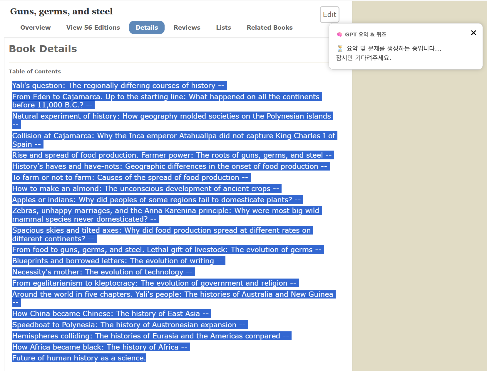

# Summary Expansion Tools

This repository contains a Chrome extension for summarizing selected text and a small proxy server used to query the OpenAI API.

---

## 🧩 Project Structure

### gpt-proxy-server

1. Install dependencies (requires Node.js):

   ```bash
   npm install
   ```

2. Set `OPENAI_API_KEY` in a `.env` file or your environment.
3. Run the server:

   ```bash
   node index.js
   ```

The server exposes `POST /gpt` to generate a summary and quiz from text.

---

### text-summarizer (Chrome Extension)

Load the `text-summarizer` folder as an unpacked extension in Chrome.  
Right-click selected text to generate a summary and quiz.  
Results are stored locally and shown via the extension popup.

---

## 🖼️ Screenshots

### 📚 Book: Guns, Germs, and Steel — Selection & Prompt


### 🧠 Generated Summary + Quiz for Guns, Germs, and Steel


### 📘 Book: The Selfish Gene — Selection & Prompt


### 🧠 Generated Summary + Quiz for The Selfish Gene


### ⏳ Loading Message When Request is Running


---

## 📦 Folder Structure

```
Summary-Expansion/
├── gpt-proxy-server/
│   ├── index.js
│   └── .env.example
├── text-summarizer/
│   ├── background.js
│   ├── popup.html
│   ├── manifest.json
│   └── style.css
├── Image/
└── README.md
```

---

## ⚙️ Requirements

- Node.js (v14+ recommended)
- OpenAI API key
- Google Chrome (for extension testing)

---

## 🚀 How to Use

1. Run `node index.js` inside `gpt-proxy-server`
2. Load `text-summarizer` in Chrome Extensions as "unpacked"
3. Select text on a webpage → Right-click → "Generate Summary & Quiz"
4. View results in the popup

